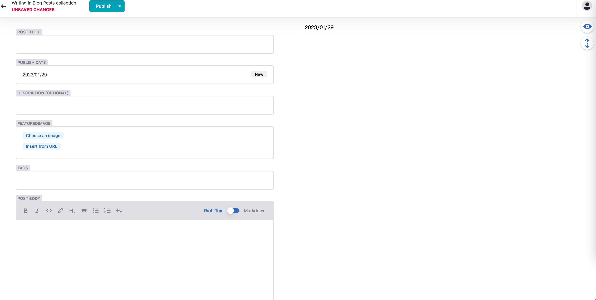

## 升级Astro版本
- 由于依赖较多, 所以直接使用```ncu -u```指令全部升级启动项目, 看看有什么问题, 记录一下
### 问题
1.Rss报错
 - 原因是```@astrojs/rss@2.1.0```版本为了配合内容管理功能, 在读取流文件的时候采用了新方法, 但是需要配合 ```getCollection```, 如果你和我一样是静态网站, 最好使用```@astrojs/rss@2.0.0```版本
2.安装astro-netlify-cms后Vue组件报错
 - 原因令人难过, 排查了15分钟原来是插件加载顺序问题, 需要把Vue的插件放到最后面

## 配置NetlifyCMS
- 由于我的个人网站是部署在Netlify上的, 所以就使用NetlifyCMS来管理内容
- 安装 ```pnpm add astro-netlify-cms```
- 配置如下
```js
// astro.config.mjs
NetlifyCMS({
  config: {
    // Use Netlify’s “Git Gateway” authentication and target our default branch
    backend: {
      name: 'git-gateway',
      branch: 'main',
    },
    // Configure where our media assets are stored & served from
    media_folder: 'public/assets/images/blog',
    public_folder: '/assets/images/blog',
    // Configure the content collections
    collections: [
      {
        name: 'posts',
        label: 'Blog Posts',
        label_singular: 'Blog Post',
        folder: 'src/pages/blog/posts',
        create: true,
        delete: true,
        fields: [
          { name: 'title', widget: 'string', label: 'Post Title' },
          {
            name: 'publishDate',
            widget: 'datetime',
            format: 'YYYY/MM/DD',
            date_format: 'YYYY/MM/DD',
            time_format: false,
            label: 'Publish Date',
          },
          {
            name: 'description',
            widget: 'string',
            label: 'Description',
            required: false,
          },
          {
            label: 'featuredImage',
            name: 'thumbnail',
            widget: 'image',
            required: true,
          },
          { label: 'Tags', name: 'tags', widget: 'list' },
          { name: 'body', widget: 'markdown', label: 'Post Body' },
          {
            label: 'Layout',
            name: 'layout',
            widget: 'hidden',
            default: '../../../layouts/Post.astro',
          },
        ],
      },
    ],
  },
})
```
- 配置完成后, 访问```/admin```即可进入管理页面, 和封面图一样, 有点简陋, 但是功能还是很不错的
- 点击 New Blog Post 就会新建md文件, 里面就是我们书写的内容, 保存后就会自动部署到Netlify上了

### 配置Netlify
- 需要开启Identity服务, 以及Git Gateway, 第一次可以选择所有人访问, 注册后改成受邀请访问就可以了

- 下面就是书写博客的图片


### NetlifyCMS的问题
- 内容书写中文光标错位, 目前我已经提了issue, 但是还没有解决, 有兴趣的可以去看看